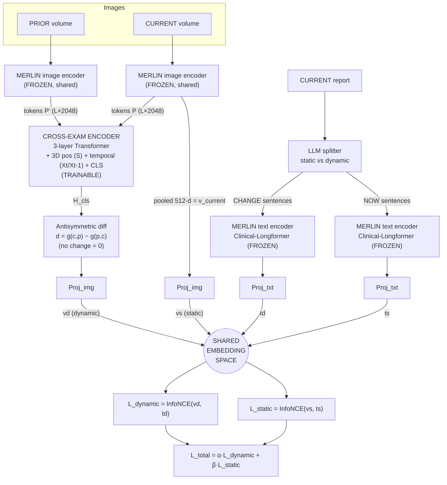

# TempA-VLP–Inspired Architecture (MERLIN / 3D CT)

**Scope of this diagram:** only the two contrastive objectives are shown —
`L_static` and `L_dynamic`. (RECIST / focal-CE / inversion / grounding losses are
omitted here on purpose.)

Frozen = pretrained MERLIN, weights not updated.
Trainable = only the cross-exam encoder + projection heads.

---

## 1. ASCII flow diagram

```
        PRIOR CT volume                          CURRENT CT volume
       (224×224×D)                              (224×224×D)
             │                                         │
             ▼                                         ▼
   ┌────────────────────┐                   ┌────────────────────┐
   │ MERLIN image encoder│  ◄─ shared wts ─► │ MERLIN image encoder│   (FROZEN)
   │ i3D ResNet-152      │                   │ i3D ResNet-152      │
   └────────────────────┘                   └────────────────────┘
             │                                    │            │
     layer4 tokens P′                     layer4 tokens P      │ pooled 512-d
     (L × 2048)                           (L × 2048)           │  = v_current
             │                                    │            │
             │                                    │            └──────────────┐
             │         + 3D positional enc (S)    │                           │
             │         + temporal enc (Xt-1 / Xt) │                           │
             └───────────────┬────────────────────┘                          │
                             ▼                                                │
              ┌───────────────────────────────┐                              │
              │   CROSS-EXAM ENCODER           │   (TRAINABLE)                │
              │   3-layer Transformer          │                              │
              │   input: [ P+S+Xt ;            │                              │
              │            P′+S+Xt-1 ;         │                              │
              │            CLS ]               │                              │
              └───────────────────────────────┘                              │
                             │                                                │
                    H_cls (dynamic token)                                     │
                             │                                                │
                 ┌───────────────────────┐                                    │
                 │  ANTISYMMETRIC DIFF    │  d = g(c,p) − g(p,c)               │
                 │  (our upgrade)         │  → "no change" = 0                 │
                 └───────────────────────┘                                    │
                             │                                                │
                          Proj_img                                       Proj_img
                             │ v_dynamic (vd)                                 │ v_static (vs)
                             ▼                                                ▼
   ══════════════════════════ SHARED EMBEDDING SPACE ══════════════════════════
                             ▲                                                ▲
                             │ t_dynamic (td)                                 │ t_static (ts)
                          Proj_txt                                       Proj_txt
                             │                                                │
              ┌───────────────────────────────────────────────────────────────┐
              │              MERLIN text encoder (Clinical-Longformer)          │  (FROZEN)
              └───────────────────────────────────────────────────────────────┘
                             ▲                                                ▲
                   "CHANGE" sentences                              "NOW" sentences
                   (dynamic)                                       (static)
                             └───────────────────┬────────────────────────────┘
                                                 │
                                   ┌──────────────────────────┐
                                   │  LLM report splitter      │
                                   │  static  vs  dynamic       │
                                   └──────────────────────────┘
                                                 ▲
                                        CURRENT report (free text)


   ── LOSSES ─────────────────────────────────────────────────────────────────
     L_dynamic = InfoNCE( vd , td )     # change-vector  ↔  "change" sentences
     L_static  = InfoNCE( vs , ts )     # current image  ↔  "now"    sentences

     L_total   = α · L_dynamic  +  β · L_static
   ─────────────────────────────────────────────────────────────────────────────
```

---

## 2. Mermaid version (renders on GitHub / Markdown preview)



---

## 3. The four embeddings (what feeds the two losses)

| Embedding | Source | Meaning |
|-----------|--------|---------|
| **vs** (static image)  | current volume → MERLIN pooled 512-d → Proj | "what the scan looks like now" |
| **vd** (dynamic image) | prior+current tokens → cross-exam encoder → **antisymmetric d** → Proj | "what changed between the scans" |
| **ts** (static text)   | "now" sentences → Longformer → Proj | current-state description |
| **td** (dynamic text)  | "change" sentences → Longformer → Proj | comparison/progression description |

## 4. The two games (losses)

- **Static game:**  pull **vs ↔ ts** together (current image ↔ "now" words).
- **Dynamic game:** pull **vd ↔ td** together (change vector ↔ "change" words).
- Combined: `L_total = α·L_dynamic + β·L_static`.

## 5. What is frozen vs trained

- **Frozen:** MERLIN image encoder (i3D ResNet-152) and text encoder (Clinical-Longformer).
- **Trainable:** the cross-exam Transformer, the antisymmetric-diff step, and the
  four small projection heads (Proj_img ×2, Proj_txt ×2).

## 6. Difference from vanilla TempA-VLP

- TempA-VLP's `vd` = raw CLS token (change learned implicitly; weak on "stable").
- **Our `vd` = antisymmetric difference** `d = g(c,p) − g(p,c)`, so an unchanged pair
  maps to the zero vector → "stable" is representable by construction.
- Backbone (2D ViT patches) → **3D CT** MERLIN `layer4` tokens.
- Report split comes from an **LLM** (CT has no Chest-ImaGenome scene graph).

