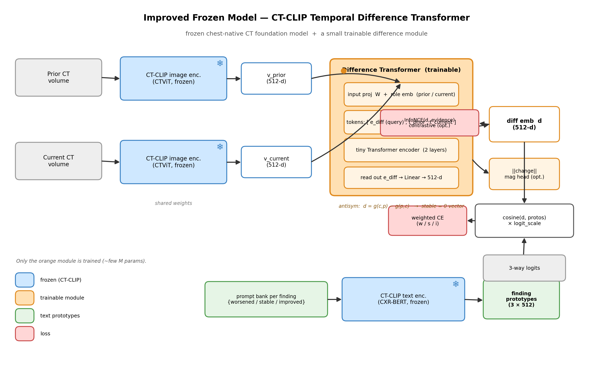

# Improved Frozen Model — CT-CLIP Temporal Difference Transformer
### Full technical report for configuration: `ANTISYM = False`, `MAGNITUDE = True`, `USE_CONTRASTIVE = True`



Source of truth: `notebooks/train_ctclip_temporal_colab.ipynb` (cells 8–11) and
`scripts/13_medgemma_label.py` (label provenance). This document explains every component,
every tensor shape, every loss term, and — importantly — the specific consequences of the
three flags you have set.

---

## 0. TL;DR

You are training a **~1.8M-parameter difference module** on top of a **frozen CT-CLIP**
foundation model to classify, for each `(scan-pair, finding)`, whether that finding
**worsened / stayed stable / improved** between a prior and a current CT.

- Both CT-CLIP encoders (image **and** text) are **frozen**; only the difference module trains.
- The module turns two frozen 512-d scan vectors into one **difference embedding `d`**.
- `d` is classified by **cosine similarity** against 3 frozen text **prototypes** per finding.
- Your flags mean the objective is:

  **`L = CE(worse/stable/improved)  +  0.5 · BCE(change-vs-stable magnitude)  +  0.5 · InfoNCE(d, evidence sentence)`**

- `ANTISYM=False` → "stable" is **not** structurally the zero vector; the model must **learn**
  direction and no-change from data (the magnitude head helps here).
- `MAGNITUDE=True` → an auxiliary head predicts *how much* changed; **note:** in the current
  code it shapes `d` via the loss but is **not** used to route predictions at inference.
- `USE_CONTRASTIVE=True` → `d` is additionally pulled toward the finding's `evidence` sentence
  (a MedGemma-selected current-report quote — a **noisy proxy** for a true "dynamic" sentence).

---

## 1. Where this sits (design philosophy)

CT-CLIP (a.k.a. the chest-native CTViT + CXR-BERT contrastive model) is a **single-image**
foundation model: it embeds one CT volume and aligns it to report text. It has **no notion of
time**. Temporal-progression benchmarks like CheXTemporal show that even strong models collapse
on this task (best ≈27% on 5-class progression; they do fine on "worse" and fail on "stable").

Rather than fine-tune a 3D foundation model (expensive, and easy to overfit on a few hundred
longitudinal pairs), we keep it **frozen** and learn a **small adapter** that operates on its
embeddings. This is the central bet: *most of the temporal signal is recoverable from the frozen
representation if we learn the right difference operator.* Freezing also lets us **cache** the
image features once and train the adapter on cached tensors at large batch sizes — turning a
multi-GPU job into a single-GPU afternoon.

---

## 2. Data pipeline

**Pairs → examples.** We use CT-RATE prior→current pairs (`data/ctrate/subset_pairs.csv`,
patient-grouped `train/val/test`). Each pair is silver-labeled by MedGemma-27B
(`medgemma_labels_v3.jsonl`). A pair contributes **one example per explicit finding**, so the
pairs expand into thousands of `(pair, finding)` examples.

**Exact pair counts (from `subset_pairs.csv`):**

| | pairs | patients |
|---|---:|---:|
| train | **420** | 357 |
| val   | **90**  | 81 |
| test  | **90**  | 80 |
| **total** | **600** | **518** |

600 unique `(patient, prior, current)` pairs, drawn from **1,147 unique CT volumes** across
**518 patients** (volumes < 2×pairs because a scan can serve as the prior in one pair and the
current in another; patients < pairs because some patients contribute multiple pairs). The
per-finding expansion of these pairs:


| split | examples | worsened | stable | improved |
|------|---------:|--------:|------:|--------:|
| train | 3,550 | 1,203 | 1,313 | 1,034 |
| val   |   733 |   253 |   264 |   216 |
| test  |   740 |   261 |   249 |   230 |

(`not_explicit` findings — 1,336 — are skipped; **18** unique findings.)

**Critical subtlety (effective diversity).** The module produces **one `d` per pair**; all of a
pair's ~8 findings share that `d`. So the *image side* only ever sees ~**420 distinct pairs**,
while the *classifier* sees ~3,550 labels. Overfitting on anything touching the image
representation is governed by the 420, not the 3,550. Examples are **not independent** (finding-
clustered within pairs) → report metrics as pair-aware and keep the split **patient-grouped**
(it is) so no pair's findings leak across splits.

**Label provenance (why the classes are what they are).** The 5-class CheXTemporal taxonomy
(`new/worse/stable/improved/resolved`) is mapped to a 3-way **direction**
(`worsened/stable/improved`) for this model. `new`→worsened, `resolved`→improved, etc. Only
`tier == "explicit"` findings are used (the model was confident the report states a change/state).

---

## 3. Frozen backbone (CT-CLIP)

**Image tower (frozen).** Each CT volume → a single **512-d** embedding (`v_prior`, `v_current`).
These are produced once by `ctclip_features_colab.ipynb` and cached to Drive (`ctclip_cache/img`,
~1 MB/scan). The training notebook **never** runs the image encoder — it loads these tensors.
This is why the whole thing fits on one GPU with batch sizes in the hundreds/thousands.

**Text tower (frozen).** CXR-BERT + `to_text_latent` maps a sentence → a **512-d** vector in the
**same joint space** as the image embeddings. We use it for two things: (a) building class
prototypes (§4), and (b) embedding the `evidence` sentences for the contrastive loss (§6.3).
Because image and text share the space, cosine similarity between `d` and a text vector is
meaningful.

---

## 4. Text prototypes (the classifier's "labels")

For each finding `f` and each class `c ∈ {worsened, stable, improved}` we write a small bank of
paraphrase templates, e.g. for *worsened*:

```
"{f} has increased compared to the prior study"
"{f} has worsened since the previous exam"
"interval enlargement of {f}"
"new {f}"
"increased {f}"
```

We embed each template with the frozen text tower, average within a class, and L2-normalize →
a **(3, 512)** prototype matrix per finding. Prototypes are **cached** (`proto_bank.pt`).

Why prototypes instead of a learned linear classifier head? Because it keeps the decision in the
**shared image–text space** and makes the model **zero-shot-flavored** and interpretable: a
prediction is "which of these three sentences is `d` most aligned with?" It also means the label
semantics come from language, not from a randomly-initialized weight matrix — closer to your
original CLIP-style thesis.

---

## 5. The trainable Difference Transformer (the only trained module)

This is `class DifferenceTransformer` (cell 8). With your config it has `antisym=False`,
`magnitude=True`. Working width `d_model = 256` (a deliberate bottleneck; see §5.5).

### 5.1 Inputs
`v_prior, v_current ∈ ℝ^512` (frozen, from cache).

### 5.2 Tokenization into a 3-token sequence
```python
tp = W(v_prior)   + role[0]      # "prior"   token, ℝ^256
tc = W(v_current) + role[1]      # "current" token, ℝ^256
ed = e_diff (learned query)      # ℝ^256
seq = stack([ed, tp, tc])        # (B, 3, 256)
```
- **`W: Linear(512→256)`** — shared projection into the module's working width.
- **`role` (2×256, learned)** — a "prior" tag and a "current" tag. **This is what encodes time's
  arrow.** Without it the two scans are exchangeable and the model can't tell worsened from
  improved. (With `ANTISYM=False`, this is the *only* thing giving the model directionality —
  see §7.1.)
- **`e_diff` (1×256, learned query)** — a token that is *not* derived from either scan. It acts
  as the question "what changed?" and is the slot that will hold the answer.

### 5.3 The comparison (self-attention)
```python
h = TransformerEncoder(seq)      # 2 layers, 4 heads, FFN=1024, GELU
h_diff = h[:, 0]                 # take the e_diff token's output, ℝ^256
```
Self-attention lets `e_diff` attend to both scan tokens (and them to each other), so the module
learns a **soft, nonlinear, content-aware** comparison — e.g. "current has mass signal prior
lacks" — rather than a fixed subtraction. Using a dedicated query token (à la a `[CLS]`/DETR
object query) means the difference is **read out of attention**, not hand-defined.

### 5.4 Read-out heads
```python
d   = head(h_diff)               # Linear(256→512): back into CT-CLIP's joint space
mag = mag_head(h_diff)           # Linear(256→1): scalar "how much changed"  (MAGNITUDE=True)
```
`d` is L2-normalized before scoring. `mag` is a logit for the change-vs-stable auxiliary (§6.2).

`ANTISYM=False` ⇒ `forward` returns `d = g(current, prior)` directly (a single pass); the
antisymmetric subtraction `g(c,p) − g(p,c)` is **skipped** (see §7.1 for what that costs).

### 5.5 Why `d_model = 256`?
It's a hyperparameter (`D_MODEL`), not required by the math (input 512, output 512, middle free).
256 = a half-width bottleneck: (a) ~4× fewer params than 512 → regularization on ~420 effective
image-pairs; (b) forces the module to **compress** to change-relevant information and discard
scan identity/anatomy. Sweep `{128, 256, 512}` on val; 512 becomes attractive only at larger data.

### 5.6 Parameter count (~1.84M)
`W` 131,328 · `role` 512 · `e_diff` 256 · 2×TransformerEncoderLayer ≈ 1,579,520 · `head` 131,584 ·
`mag_head` 257 · `logit_scale` 1  →  **≈ 1.84M trainable params.** Everything else is frozen.

---

## 6. Scoring and losses (your exact configuration)

### 6.1 Scoring: cosine vs. prototypes
```python
cos   = cosine(normalize(d), normalize(prototypes))   # (B, 3)
logit = logit_scale.exp().clamp(max=100) * cos        # temperature-scaled
```
`logit_scale` is the learned CLIP temperature (init `log(1/0.07)`). It converts cosines in
`[-1, 1]` into logits with enough dynamic range for a confident softmax. Prediction = `argmax`
over the 3 classes.

### 6.2 Base loss — weighted cross-entropy (**always on**)
```python
L_ce = CrossEntropy(logits, y, weight=W)              # W = inverse-frequency class weights
```
This is the supervised signal that actually produces worsened/stable/improved and all F1 numbers.
Class weights counter the mild imbalance (stable is the plurality). **This term anchors training.**

### 6.3 Magnitude term (**ON in your config**)
```python
is_change = (y != stable).float()                     # 1 for worsened/improved, 0 for stable
L_mag = BCEWithLogits(mag, is_change)
L    += 0.5 * L_mag                                    # LAMBDA_MAG = 0.5
```
**Purpose.** Cosine similarity is scale-invariant: it sees only the *direction* of `d`, never its
*length*. But "stable" is fundamentally a **no-change / small-magnitude** condition — the reason
temporal models collapse on "stable." The magnitude head gives the module a place to represent
"how much changed" as a scalar, and the BCE trains it to separate change (worsened/improved) from
no-change (stable). Gradients flow back into `h_diff`, so this **shapes the shared representation**
to encode magnitude, which indirectly helps the cosine classifier tell stable apart.

**Important honesty caveat.** In the current notebook, `mag` is used **only in the loss**. At
inference (`logits_from` → `argmax` over the 3 prototypes) the magnitude head is **not** consulted
to route "stable." So with your config the magnitude head is an **auxiliary representation-shaping
regularizer**, *not* an active "stable-vs-change gate" at test time. If you want it to actually
route decisions (the "threshold on ‖d‖/mag → stable" idea), that requires a small change to the
inference path (see §9). As-is, expect the magnitude term to *help stable F1 modestly* by
improving the representation — not to hard-gate anything.

### 6.4 Contrastive term (**ON in your config**)
```python
ev   = embed(evidence_sentence)                       # frozen text tower, 512-d, cached
keep = ev.norm > 0                                    # skip examples with empty evidence
z    = logit_scale.exp() * ( normalize(d[keep]) @ normalize(ev[keep]).T )   # (K, K)
L_con = 0.5 * ( CE(z, arange) + CE(z.T, arange) )     # symmetric InfoNCE
L    += 0.5 * L_con                                   # LAMBDA_CON = 0.5
```
**Purpose.** This is the piece closest to your original thesis: *align the difference embedding
with the report's change language.* Within a batch, each `d` must be most similar to **its own**
`evidence` sentence and vice-versa; all other examples are negatives. This pushes `d` to encode
**finding-specific** change ("effusion larger" vs "nodule smaller"), not just a coarse 3-way axis,
and enables retrieval-style evaluation.

**What `evidence` actually is (and its caveat).** `evidence` is chosen by **MedGemma-27B**: the
labeling prompt (`13_medgemma_label.py`, line 62) asks, per finding, for *"a short quote from the
CURRENT report supporting this [change label]."* It is greedy-decoded and **not** validated as a
verbatim substring, and — because it must quote the *current* report while genuine comparison
language is routed to a separate `dynamic_sentences` field — it is **often a static present-state
description** ("Heart contour and size are normal.") rather than a comparison clause. So aligning a
*change* embedding `d` to a *static* sentence partially **reintroduces the collapse** we want to
avoid (`d` drifting toward "describe the current state"). It's a **noisy proxy**; treat this term
as an approximate auxiliary, not the principled objective.

**Batch/negative caveat.** In-batch negatives are other patients' sentences → *easy* (the model
can win on finding/anatomy identity rather than direction). Without hard negatives (polarity-
flipped rewrites, the prior report's dynamic sentences), the contrastive term can look good on
retrieval while remaining direction-blind.

### 6.5 Total objective (your config)
```
L = L_ce  +  0.5 · L_mag  +  0.5 · L_con
```
All three are combined **additively** (multi-task). CE is the readout you evaluate; the other two
are auxiliaries that shape the shared `d`. `LAMBDA_MAG`, `LAMBDA_CON` control how much the
auxiliaries influence `d` without overriding classification.

---

## 7. What your specific flag settings mean

### 7.1 `ANTISYM = False` — direction is learned, not structural
With antisymmetry ON, `d = g(c,p) − g(p,c)` guarantees three things *for free*: time-reversal flips
`d`'s sign, worsened/improved are antipodal, and **stable = the zero vector exactly** (the fixed
point). With it **OFF (your setting)**:
- The model runs **one** forward pass (half the compute), and must **learn** directionality purely
  from the `role` embeddings and supervision.
- "Stable" has **no privileged geometry** — it's just another direction the classifier must carve
  out. This is precisely the regime where cosine struggles with no-change, which is **why you have
  `MAGNITUDE=True`** — the magnitude head is compensating for the missing structural zero.
- Practically: expect the model to rely more heavily on the magnitude auxiliary and class weights
  to get "stable" right; it will not enjoy the built-in symmetry/direction guarantees. This is a
  reasonable baseline configuration, and comparing it against `ANTISYM=True` is one of your most
  informative ablations.

### 7.2 `MAGNITUDE = True` — helps the representation, not (yet) the decision rule
See §6.3. It adds a change-vs-stable signal that improves how `d` encodes magnitude, which given
`ANTISYM=False` is doing real work to recover "stable." But remember it does **not** gate inference
in the current code.

### 7.3 `USE_CONTRASTIVE = True` — thesis-aligned auxiliary, noisy supervision
See §6.4. It enriches `d` with report-language structure but is trained against the **`evidence`
proxy**, which is often static. Expect it to help finding-specificity and retrieval; watch that it
doesn't pull `d` toward static description (which would hurt "stable"/"worsened" separation).

---

## 8. Training procedure

- **Optimizer:** AdamW, `lr = 1e-3`, `weight_decay = 1e-2`.
- **Batch:** 256 (on cached tensors — trivially large because features are precomputed).
- **Epochs:** up to 120, **early-stopping on val macro-F1**, `patience = 20`; best state restored.
- **Class weights:** inverse-frequency over the 3 classes (mild rebalancing toward the minority).
- **Determinism:** seeds fixed (`torch`/`numpy`), greedy — reproducible runs.
- **Everything frozen except the ~1.84M module** → fast; a full run is minutes on one GPU.

---

## 8.5 Results (this run — `ANTISYM=False, MAGNITUDE=True, USE_CONTRASTIVE=True`)

### Dataset actually used
```
train: 3550 ex  (worsened=1203  stable=1313  improved=1034)
val  :  733 ex  (worsened=253   stable=264   improved=216)
test :  740 ex  (worsened=261   stable=249   improved=230)
skipped: {'not_explicit': 1336}
unique findings: 18
```

### Training log (early-stopped)
```
ep   1  loss 4.290  val_macroF1 0.453  (best 0.453)
ep  10  loss 3.869  val_macroF1 0.512  (best 0.549)
ep  20  loss 3.618  val_macroF1 0.514  (best 0.549)
early stop @ ep 26  best val macro-F1 0.549
restored best. val macro-F1 = 0.549 | ANTISYM=False MAGNITUDE=True CONTRASTIVE=True
```
Best val macro-F1 was reached early (~ep 10) and did not improve for 20 epochs → early stop at
ep 26. This is expected for a ~1.8M module on ~420 effective image-pairs: it fits the recoverable
signal fast, then plateaus. The falling training loss with flat val macro-F1 after ep ~10 indicates
the later epochs mostly reduce the auxiliary (magnitude/contrastive) losses without improving the
3-way decision — consistent with those terms being representation-shapers, not the readout.

### TEST — per class
```
accuracy : 0.534
macro-F1 : 0.530   (always-stable ref = 0.168)
  F1 worsened : 0.517
  F1 stable   : 0.426
  F1 improved : 0.647

confusion (rows = true, cols = pred; order w / s / i):
        pred:w  pred:s  pred:i
 true:w   133      73      55
 true:s    92      97      60
 true:i    29      36     165
```

**Headline.** macro-F1 **0.530** vs. the always-`stable` floor **0.168** — the module is doing real
temporal work (≈3.2× the trivial baseline), and test (0.530) tracks val (0.549) closely → no
meaningful overfitting.

**Per-class reading (this is the informative part).**
- **improved (0.647)** is strongest. Its row is clean: 165/230 correct, little leakage. "Improved/
  resolved" language ("resolved", "not detected", "decreased") is distinctive and the frozen text
  prototypes capture it well.
- **worsened (0.517)** is middling: 133/261 correct, but **73 worsened → predicted stable** and
  **55 → improved**. The improved-confusion is the concerning one (opposite direction) and points
  at genuine direction ambiguity, not just a stable/no-change issue.
- **stable (0.426) is the weakest — exactly as this report predicted (§6.3, §7.1).** Only 97/249
  correct; it bleeds heavily into **worsened (92)** and **improved (60)**. This is the classic
  "stable collapse": with `ANTISYM=False` there is no structural zero for no-change, and the
  magnitude head — being **auxiliary-only at inference (§6.3)** — shapes the representation but does
  **not** gate the decision, so it can't rescue "stable" on its own. That the magnitude head still
  lifts stable well above the 0.168 floor suggests wiring it into inference (§10.1) is the single
  most promising next change.

### TEST — per disease (finding)
`macroF1*` = macro-F1 over the classes actually present for that finding.

| finding | n | acc | macroF1* |
|---|---:|---:|---:|
| Cardiomegaly | 76 | 0.526 | 0.482 |
| Pericardial effusion | 76 | 0.697 | 0.432 |
| Lymphadenopathy | 74 | 0.459 | 0.385 |
| Pleural effusion | 63 | 0.571 | 0.355 |
| Lung nodule | 52 | 0.385 | 0.366 |
| Consolidation | 49 | 0.612 | 0.439 |
| Lung opacity | 45 | 0.689 | 0.560 |
| Atelectasis | 42 | 0.429 | 0.411 |
| Peribronchial thickening | 35 | 0.543 | 0.523 |
| Emphysema | 32 | 0.375 | 0.259 |
| Pulmonary fibrotic sequela | 30 | 0.567 | 0.481 |
| Coronary artery wall calcification | 27 | 0.519 | 0.472 |
| Hiatal hernia | 27 | 0.630 | 0.427 |
| Arterial wall calcification | 25 | 0.480 | 0.285 |
| Interlobular septal thickening | 25 | 0.520 | 0.347 |
| Medical material | 23 | 0.565 | 0.385 |
| Bronchiectasis | 22 | 0.364 | 0.257 |
| Mosaic attenuation pattern | 17 | 0.471 | 0.536 |

**Per-disease reading.**
- **Best macro-F1:** Lung opacity (0.560), Mosaic attenuation (0.536), Peribronchial thickening
  (0.523) — findings that genuinely change over short intervals and have clear directional
  language, so the difference embedding has real signal to latch onto.
- **Worst macro-F1:** Bronchiectasis (0.257), Emphysema (0.259), Arterial/Coronary wall
  calcification (0.285/0.472), Interlobular septal thickening (0.347) — mostly **chronic, slowly-
  or non-changing** findings that are overwhelmingly "stable" in reality. These are hard for two
  reasons that compound: (a) they're dominated by the weakest class (stable), and (b) their reports
  rarely use interval language, so both the label and the text signal are thin. High *accuracy* with
  low *macro-F1* (e.g. Pericardial effusion: acc 0.697, macroF1 0.432) is the tell-tale sign of a
  finding where one class dominates and the minority classes are missed.
- **Caveat:** several findings have small n (17–27), so per-disease macro-F1 is noisy; read these as
  directional, not definitive.

### What `evidence` was actually used in the contrastive term (this run)
The contrastive loss (`USE_CONTRASTIVE=True`) used, as each example's positive, the **per-finding
`evidence` string** from `medgemma_labels_v3.jsonl` — a MedGemma-selected quote from the *current*
report (§6.4). Measured over the explicit findings actually fed to training:

```
explicit findings (3-class):                    22,222
  with non-empty evidence (used as positives):  22,218  (100.0%)  # keep-mask drops only 4
  unique evidence strings:                       10,331
  evidence length (words):                       median 8, mean 8.6, max 31
  non-empty by direction:  worsened 7,007 | improved 8,671 | stable 6,540
```

**These positives are frequently NOT direction-bearing.** Real examples used verbatim:
- `worsened` ← *"Central venous catheter is seen on the right."*  (no worsening expressed)
- `improved` ← *"Heart contour and size are normal."*  (no comparison at all)
- `stable`   ← *"heart contour, size are normal"*

**Quantified ambiguity — the key problem.** Because `evidence` describes the current state rather
than the change, the *same* sentence is often reused as the positive for *different* directions:

```
unique evidence strings mapped to >1 direction:  451 (4.4% of unique)
finding-instances whose evidence is direction-ambiguous: 9,507 / 22,218  (42.8%)
```
Top collisions (same text, opposite/overlapping labels):

| evidence text (lower-cased) | used for |
|---|---|
| "heart contour, size are normal" | stable 403, **improved 415** |
| "pericardial effusion-thickening was not observed" | **improved 561**, stable 244 |
| "no pleural or pericardial effusion was detected." | **improved 534**, stable 77 |
| "heart contour and size are normal." | **improved 436**, stable 161 |
| "no enlarged lymph nodes ... were detected" | improved 208, stable 233 |

So for **~43% of training examples** the contrastive target is a sentence that also serves as the
positive for a *different* direction. That means InfoNCE(`d`, `evidence`) **cannot** teach direction
on those examples — at best it teaches finding identity/current-state, and at worst it pulls
`worsened`/`improved`/`stable` embeddings that share identical evidence text *toward each other*.
This is almost certainly a contributor to the **stable↔change confusion** seen in the per-class
results, and it is the concrete, measured justification for the §10.2 recommendation to replace the
`evidence` proxy with the real `dynamic_sentences` (which *do* carry the comparison) plus hard
negatives.

### Bottom line for this configuration

The frozen-backbone + difference-module bet **works** at the headline level (0.530 macro-F1, 3.2×
the floor, val/test aligned). The failure mode is precisely the one the design anticipated — **"stable"
is the weakest class and the largest source of confusion** — and it is attributable to two
addressable choices in *this* config: `ANTISYM=False` (no structural zero) and the magnitude head
being auxiliary-only. The highest-leverage next experiments, in order, are: **(1)** route "stable"
via the magnitude head at inference (§10.1); **(2)** turn on `ANTISYM=True` and compare (§10.4);
**(3)** replace the `evidence` proxy with the real dynamic/static two-path loss (§10.2).

---

## 9. Evaluation, baselines, controls


**Metrics reported.** Overall accuracy, **macro-F1**, **per-class F1** (worsened/stable/improved),
a **confusion matrix**, and **per-disease** (per-finding) accuracy/macro-F1 (over the classes
actually present for that finding). Macro-F1 is the headline because "stable" imbalance makes plain
accuracy misleading. An **always-`stable`** reference F1 is printed as the trivial floor.

**Baselines you should beat (cheapest first):**
1. always-`stable` (printed) — the trivial floor.
2. `v_current − v_prior` fed to the *same* cosine head — the linear-difference floor. **If the
   Transformer doesn't beat this, the module isn't earning its parameters.**
3. `v_current` alone (current-only) — must be beaten, or the prior is being ignored.

**Non-negotiable controls (sanity that it models change, not shortcuts):**
- **Prior-shuffle:** replace the prior with a random patient's prior → performance **must collapse**.
  If it doesn't, the module is reading the current scan (or anatomy) and ignoring the prior.
- **Order-inversion:** swap prior↔current → worsened/improved should swap. With `ANTISYM=False`
  this is a *learned* behavior, so this control directly tests whether the `role` embeddings did
  their job.
- **Current-only ablation** (as above).

**Suggested extra (given you have the data):** a **static/dynamic alignment** eval — does `d`
preferentially retrieve *dynamic* sentences and `v_current` retrieve *static* ones? (You already
have real `dynamic_sentences`/`static_sentences` in `medgemma_labels (2).jsonl`; see §10.)

---

## 10. Known limitations & recommended next steps

1. **Magnitude head is auxiliary-only at inference.** To make it *route* "stable", add a gate:
   e.g. predict `is_change = σ(mag)`; if below a val-tuned threshold, output `stable`, else argmax
   over {worsened, improved}. This operationalizes the "cosine can't see no-change" fix.
2. **`evidence` is a noisy proxy for dynamic text.** The **real** dynamic/static split already
   exists in `medgemma_labels (2).jsonl` (`dynamic_sentences`, `static_sentences`). Swap the
   `evidence` InfoNCE for the principled **two-path** objective:
   `L_dyn = InfoNCE(d, dynamic_sentences)` + `λ · L_static = InfoNCE(v_current, static_sentences)`.
   The static path is nearly free (frozen features) and is what structurally prevents `d ≈ v_current`.
3. **Add hard negatives** to the contrastive term: LLM polarity-flipped rewrites ("increased"→
   "decreased"), the prior report's dynamic sentences, and `d` vs. a mismatched prior. This is where
   direction-awareness is actually forced.
4. **Turn `ANTISYM` on as an ablation.** It gives stable=0 and direction-by-construction; comparing
   `{antisym off (yours), antisym on}` is a clean, publishable result and subsumes TILA-style
   inversion as a constraint rather than a loss.
5. **Effective-diversity caveat in reporting.** ~3,550 examples cluster within ~420 pairs; report
   pair-grouped metrics and keep patient-grouped splits (done) to avoid leakage.
6. **Global-pooling ceiling.** CT-CLIP's globally-pooled embedding may simply not preserve the fine
   spatial detail small-lesion interval change needs — if the module plateaus, that itself is a
   finding, and motivates tapping pre-pool feature grids in a future version.

---

## 11. One-paragraph summary (for a slide)

We freeze CT-CLIP (image + text) and train a ~1.8M-parameter **Difference Transformer** that reads
two cached 512-d scan embeddings via prior/current **role tokens** and a learned **`e_diff` query**,
emitting a difference embedding `d` in the shared image–text space. Each `(pair, finding)` is
classified by **cosine** of `d` against three frozen text **prototypes** (worsened/stable/improved).
The objective combines **cross-entropy** (always), a **change-vs-stable magnitude** auxiliary
(`MAGNITUDE=True`, which compensates for having `ANTISYM=False`), and an **InfoNCE** alignment of
`d` with the report's change language (`USE_CONTRASTIVE=True`, currently against the noisy
`evidence` proxy). It trains in minutes on one GPU because the frozen features are cached, and it is
evaluated with per-class and per-disease F1 against `v_current−v_prior`, current-only, and
prior-shuffle controls.
