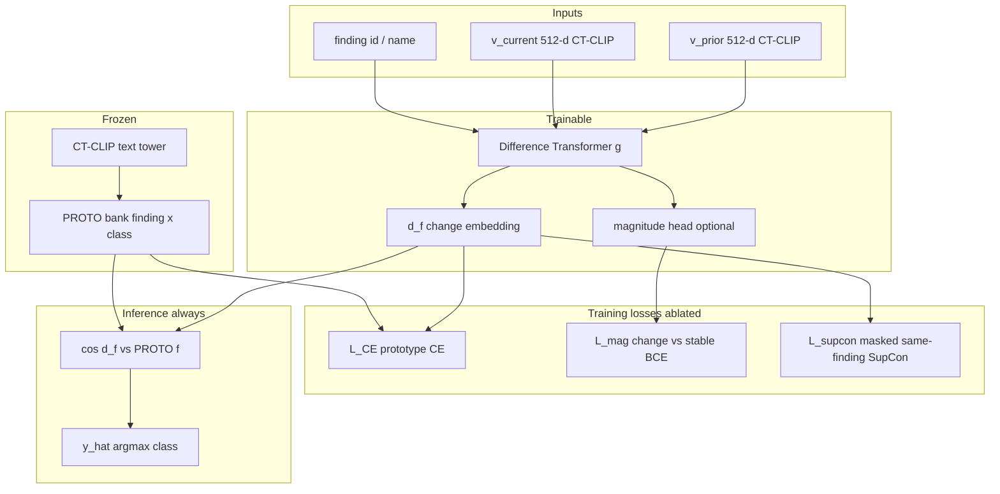

# Loss Ablation Report — Finding-Conditioned CT Temporal Progression

**Date:** 2026-08-17  
**Notebook:** `notebooks/train_proposed_finding_conditioned_colab.ipynb`  
**Run tag:** `loss_ablation_20260817_020740`  
**Checkpoints:** `Drive/3dCT/ctclip_cache/ablations/proposed_ablation_*.pt`

---

## 1. Project context

### 1.1 Problem

We adapt **CheXTemporal-style** temporal-progression reasoning from chest X-ray to **3D chest CT**.

Given a patient's **prior** and **current** CT (and a clinical **finding** name), predict the direction of change:

| Class | Meaning |
|-------|---------|
| **worsened** | new or increased disease for that finding |
| **stable** | no meaningful change |
| **improved** | decreased or resolved |

This is a *relational* task: single-study foundation models (CT-CLIP, MERLIN) embed one volume well but have **no built-in notion of time**.

### 1.2 Approach (proposed pipeline)

Keep **CT-CLIP frozen**. Train only a small **Difference Transformer** that produces a finding-conditioned change embedding:

```text
d_f = g(v_prior, v_current, finding)
```

**Inference (always):** no report text at test time — only images + finding id:

```text
y_hat = argmax_c  cos( d_f , PROTO[finding, c] )
```

where `PROTO[f, c]` is a frozen text prototype for finding `f` and class `c` (template bank embedded by CT-CLIP's text tower).

### 1.3 Optional training losses

| Loss | Role |
|------|------|
| **CE** | Cross-entropy on prototype logits — directly trains the inference head |
| **Mag** | BCE on a magnitude head: change (worsened/improved) vs stable |
| **SupCon** | Masked same-finding supervised contrastive loss on `d_f` vectors |

**SupCon mask (important):**

- **Positive:** same finding + same direction  
- **Negative:** same finding + other direction  
- **Ignored:** other findings (not treated as negatives)

Temperature `tau_con` is **separate** from CE `logit_scale`.

### 1.4 Data protocol

| Split | Source | Role |
|-------|--------|------|
| **train** | Hub CT-RATE `train_*` pairs (patient hash, ~85%) | Optimize |
| **tune** | Hub `train_*` (held-out patients, ~15%) | Early-stop on macro-F1 |
| **test** | Hub CT-RATE `valid_*` only | **One-shot** final eval |

- Labels: MedGemma silver labels, `tier=explicit` only  
- Unit: `(pair, finding)` example  
- Backbone: frozen CT-CLIP image embeddings (512-d, cached)

**Direction mix (full explicit pool, labels only):**

| Split | Examples | Worsened | Stable | Improved |
|-------|--------:|---------:|-------:|---------:|
| Hub `train_*` (train+tune) | 20,934 | 31.5% | 29.4% | 39.1% |
| Hub `valid_*` (test) | 1,288 | 31.9% | 29.7% | 38.4% |

(Colab may drop rows missing cached features; class ratios stay similar.)

**"Hub"** = official Hugging Face CT-RATE split prefixes (`train_*` / `valid_*`), not our internal names.

---

## 2. This experiment

### 2.1 Goal

Measure how much each loss contributes when **architecture, data, and inference are fixed**.

Sweep binary flags:

```text
USE_CE × USE_MAGNITUDE × USE_SUPCON  ∈  {0,1}³
```

- **8** theoretical combos  
- **Skip `(0,0,0)`** (no training signal) → **7 runs**  
- Re-init model + optimizer each combo  
- Same early-stop: max 120 epochs, patience 20 on **tune** macro-F1  
- Restore best tune checkpoint → report tune + **test** metrics once  

### 2.2 Defaults held fixed

| Knob | Value |
|------|------:|
| Finding conditioning | on |
| `LAMBDA_CE` / `LAMBDA_MAG` / `LAMBDA_CON` | 1.0 / 0.5 / 0.5 |
| `MAX_BATCH_SIZE` (CE path) | 256 |
| Contrastive batch (SupCon on) | ~K=8 findings × 3 classes × N=4 ≈ **80–96** |
| `D_MODEL`, LR | 256, 1e-3 |
| Prototype source | templates |

**Confound:** turning SupCon on also switches from random-256 batches to contrastive ~90 batches. Loss and sampler are not isolated in this sweep.

### 2.3 What we measure

- **Primary:** test macro-F1 over `{worsened, stable, improved}`  
- **Secondary:** per-class test F1, tune macro-F1, best epoch, wall time  

Chance-level macro-F1 for 3 balanced classes is ~0.33; labels are mildly improved-heavy (~39%).

---
## 3. Pipeline diagram



**Loss → geometry (why ablations differ):**

```text
                    Difference Transformer
                           |
                         d_f
                    _____/ | \_____
                   /       |       \
              CE loss   SupCon    Mag loss
           align d_f   cluster   scalar:
           to PROTO    d_f with  change vs
           text vecs   other d_f stable
                |         |         |
                v         v         v
           helps F1   can fight   helps stable
           directly   prototypes  not 3-way dir.
                \         |         /
                 \        |        /
                  v       v       v
              test F1 = nearest PROTO only
```

---

## 4. Results

### 4.1 Full loss ablation table

Sorted by **test macro-F1** (descending). Source: Colab run `20260817_020740`.

| Rank | CE | Mag | SupCon | Tune macro-F1 | **Test macro-F1** | Test F1 wors. | Test F1 stable | Test F1 impr. | Best ep | Epochs ran | Time (s) |
|-----:|:--:|:---:|:------:|-------------:|------------------:|-------------:|---------------:|--------------:|--------:|-----------:|---------:|
| 1 | ✓ | | | 0.538 | **0.554** | 0.560 | 0.414 | 0.688 | 2 | 22 | 12 |
| 2 | ✓ | ✓ | | 0.553 | **0.546** | 0.484 | 0.504 | 0.649 | 2 | 22 | 12.5 |
| 3 | ✓ | ✓ | ✓ | 0.512 | **0.508** | 0.510 | 0.371 | 0.644 | 78 | 98 | 64.2 |
| 4 | ✓ | | ✓ | 0.469 | **0.435** | 0.353 | 0.446 | 0.505 | 15 | 35 | 22.1 |
| 5 | | ✓ | ✓ | 0.349 | **0.337** | 0.226 | 0.166 | 0.618 | 12 | 32 | 20 |
| 6 | | ✓ | | 0.339 | **0.325** | 0.278 | 0.214 | 0.483 | 23 | 43 | 22.7 |
| 7 | | | ✓ | 0.285 | **0.276** | 0.449 | 0.359 | 0.021 | 4 | 24 | 14.8 |

CSV: `ctclip_cache/ablations/loss_ablation_20260817_020740.csv`

### 4.2 Compact view (test macro-F1 only)

| | Mag off, SupCon off | Mag on, SupCon off | Mag off, SupCon on | Mag on, SupCon on |
|--|--------------------:|-------------------:|-------------------:|------------------:|
| **CE on** | **0.554** | 0.546 | 0.435 | 0.508 |
| **CE off** | *(skipped)* | 0.325 | 0.276 | 0.337 |

### 4.3 Qualitative ranking

```text
CE only  ≳  CE+mag  >  CE+mag+SupCon  >  CE+SupCon  >>  any CE-off
 0.554       0.546         0.508            0.435         ~0.28–0.34
```

---

## 5. Why we saw these results

### 5.1 CE alone wins (test macro-F1 = 0.554)

**Matched objective.** Training CE pulls `d_f` toward `PROTO[f, y]` and away from other class prototypes. Test does the same nearest-prototype rule. No other loss in this study optimizes that geometry as directly.

**Fast alignment.** Best checkpoint at **epoch 2**, early stop ~22. Frozen 512-d features + small adapter + fixed text bank is an easy projection problem. Train CE loss keeps falling after the tune peak (mild overfit); early stopping correctly keeps the early weights.

**Strongest per-class pattern:**

| Class | F1 | Note |
|-------|---:|------|
| improved | 0.688 | Majority-ish + often clearer change |
| worsened | 0.560 | Decent |
| stable | 0.414 | Hardest — small change, cosine ignores magnitude |

**Ceiling ~0.55 is expected**, not a failed run: silver labels, pooled embeddings, 18 findings, inherent stable ambiguity.

---

### 5.2 Magnitude is nearly neutral on macro (−0.008)

| Class | CE only | CE + mag | Δ |
|-------|--------:|---------:|--:|
| stable | 0.414 | **0.504** | +0.09 |
| worsened | 0.560 | 0.484 | −0.08 |
| improved | 0.688 | 0.649 | −0.04 |
| **macro** | **0.554** | **0.546** | −0.008 |

**Why stable improves:** mag BCE explicitly trains “change vs no-change,” which pure direction-cosine CE under-specifies.

**Why macro does not rise:** capacity/gradient share moves a bit from worsened/improved separation into the scalar head. Mag does **not** teach worsened vs improved.

**Takeaway:** mag is a reasonable **stable auxiliary**, not a macro-F1 lever under these λ defaults.

---

### 5.3 SupCon hurts under default hyperparameters

| Setup | Test macro-F1 | vs CE only |
|-------|--------------:|-----------:|
| CE | 0.554 | — |
| CE + SupCon | 0.435 | **−0.12** |
| CE + mag + SupCon | 0.508 | **−0.05** |

**Why:**

1. **Geometry conflict.** SupCon clusters same-(finding, class) *example* embeddings together. CE pins clusters to *fixed text* vectors. With `λ_con = 0.5`, example-clusters can sit **off** the prototype axes → nearest-PROTO classification degrades even if clusters look tight internally.

2. **Batch confound.** SupCon enables contrastive sampling (~80–96 stratified rows) instead of random 256. Data diet and gradient noise change together with the loss — this sweep cannot attribute the drop to loss alone.

3. **Optimization path.** CE+SupCon needs more epochs and still underperforms; full model best @ epoch 78 (slow recovery, never catches CE-only).

4. **Per-class:** CE+SupCon damages worsened (0.353) and improved (0.505) more than it helps stable.

**Do not claim SupCon helps** from this table. A follow-up should fix CE on and sweep `λ_con ∈ {0.05, 0.1, 0.25}` and/or run SupCon with **random-256** batches to unconfound the sampler.

---

### 5.4 CE-off runs sit near chance (~0.28–0.34) — by design of the metric

Inference **always** uses prototype argmax. Without CE:

| Train losses | Test macro-F1 | Interpretation |
|--------------|--------------:|----------------|
| Mag only | 0.325 | Learns change scalar; not 3-way direction in PROTO space |
| Mag + SupCon | 0.337 | May cluster `d`s; clusters not registered to PROTO |
| SupCon only | 0.276 | Worst readout; improved F1 ≈ 0.02 |

Low F1 here means **“aux losses don’t replace prototype CE for this head,”** not necessarily “SupCon learned nothing.” Probing SupCon would need another metric (e.g. kNN in `d`-space), which this experiment did not run.

---

### 5.5 Train vs test gaps

| Combo | Tune | Test | Gap |
|-------|-----:|-----:|----:|
| CE only | 0.538 | 0.554 | test ≥ tune (small-set noise / fine) |
| CE + mag | 0.553 | 0.546 | tiny |
| Full | 0.512 | 0.508 | tiny |
| CE + SupCon | 0.469 | 0.435 | mild drop |

No catastrophic overfit. The story is **underperformance of non-CE objectives**, not tune/test leakage.

---

## 6. Conclusions

1. **Prototype CE is necessary and sufficient** for the current inference rule; it drives essentially all usable macro-F1 (**≈ 0.55** on Hub `valid_*`).  
2. **Magnitude** improves **stable** F1 at a small cost to change classes; macro ≈ flat.  
3. **Masked SupCon** at `λ_con = 0.5` with contrastive batching **reduces** test F1; treat as untuned / harmful until a λ and sampler study says otherwise.  
4. **Report main numbers from CE-only or CE+mag**; use CE-off rows as negative controls only.  
5. **Stable remains the bottleneck** (best stable F1 0.50 with mag; 0.41 with CE-only).

### One-sentence summary

> On this CT-RATE finding-conditioned setup, classification performance is driven almost entirely by prototype cross-entropy (test macro-F1 ≈ 0.55); a magnitude auxiliary slightly improves stable without lifting macro-F1; masked SupCon with default weighting and contrastive batching reduces accuracy because it optimizes within-batch geometry rather than prototype alignment.

---

## 7. Suggested follow-ups

| Priority | Experiment |
|----------|------------|
| High | Multi-seed CE-only (and CE+mag) error bars |
| High | `λ_con` grid with CE fixed on |
| High | CE + SupCon with **random 256** batches (isolate loss vs sampler) |
| Med | Batch-size sweep for CE-only (`64…512`) — expectation: flat |
| Med | Finding-conditioning on/off ablation (architecture, not loss) |
| Low | kNN probe of SupCon-only embeddings (geometry without PROTO) |

---

## 8. References in-repo

| Resource | Path |
|----------|------|
| Proposed pipeline diagram | `docs/proposed_pipeline.png` |
| Design write-up | `docs/improved_frozen_model_report.md` |
| Colab trainer | `notebooks/train_proposed_finding_conditioned_colab.ipynb` |
| Cell sources | `scripts/_proposed_nb_cells/` |
| This ablation CSV | Drive `ctclip_cache/ablations/loss_ablation_20260817_020740.csv` |


---

## 9. Follow-up experiment — cross-modal temporal SupCon (2026-08-17)

**Run tag:** `20260817_072340`  
**CSV / ckpts:** `Drive/.../ctclip_cache/ablations/proposed_ablation_*_20260817_072340.pt`  
**Notebook:** proposed pipeline after commit `0185778` (cross-modal contrastive + built-in ablation cell)

This section **does not replace** §4–6. Those results used **embedding-only** (`d`↔`d`) SupCon.  
Here the contrastive term is **cross-modal** (`d`↔ temporal **text**), with the same CE / mag / split protocol.

### 9.1 What changed vs the first ablation (detail)

| Piece | **Old** ablation (`020740`, §4) | **New** ablation (`072340`, this section) |
|-------|--------------------------------|-------------------------------------------|
| Contrastive objects | `d_i` vs other **`d_j`** (same modality) | `d_i` vs frozen **temporal-sentence emb `t_j`** |
| Text in SupCon? | **No** | **Yes** — evidence/dynamic sentences; synthetic stable templates only if no real stable text |
| Positive | same finding + same class **embedding** | same finding + same class **sentence** (incl. own sentence) |
| Negative | same finding + other class **embedding** | same finding + other class **sentence** |
| Ignored | other findings’ `d` | other findings’ **texts** |
| Instance CLIP InfoNCE? | No | Still **no** (not “all other texts in batch = negative”) |
| SupCon formula | avg log-prob over each positive | **same** (not log-sum of positives) |
| Valid anchor | ≥1 positive (old code) | ≥1 positive **and** ≥1 same-finding negative |
| Direction | n/a | **one-way** `d→text` (`symmetric=False`) |
| CE | Unchanged: cos(`d`, `PROTO[f]`) × `logit_scale` | **Unchanged** |
| Mag | Unchanged BCE | **Unchanged** |
| Batching when SupCon on | contrastive ~K×3×N | **same** sampler |
| Inference | argmax cos to PROTO; no report | **same** |
| Temperature | `tau_con` ≠ CE `logit_scale` | **same separation** |

**CE was not redesigned.** “Fixed CE” here means:

1. **Same 3-way prototype CE** as before (templates or real PROTO bank).  
2. **Same readout at test** — never uses dynamic text.  
3. Ablation still toggles CE **on/off** as a training loss; when CE is off, F1 is still measured with the prototype head (so CE-off rows probe whether mag/SupCon alone align `d` to PROTO).  
4. Only the **SupCon side** was upgraded from `d`↔`d` to `d`↔`t`.

**Temporal text construction (new):**

```text
prefer:  finding-level evidence
else:    pair-level dynamic_sentences
else if stable:  one fixed synthetic template (seeded, not resampled each epoch)
else:    class template fallback (worsened/improved only if extraction empty)
```

Sentences are embedded **once** with the frozen CT-CLIP text tower and stored as `DATA[*]['tt']`.

### 9.2 New results table (sorted by test macro-F1)

| Rank | CE | Mag | SupCon | Tune macro-F1 | **Test macro-F1** | Test F1 wors. | Test F1 stable | Test F1 impr. | Best ep | Epochs | Time (s) |
|-----:|:--:|:---:|:------:|-------------:|------------------:|-------------:|---------------:|--------------:|--------:|-------:|---------:|
| 1 | ✓ | ✓ | | 0.552 | **0.575** | 0.555 | 0.483 | 0.688 | 2 | 22 | 12.9 |
| 2 | ✓ | | | 0.547 | **0.562** | 0.503 | 0.492 | 0.691 | 1 | 21 | 11.9 |
| 3 | ✓ | ✓ | ✓ | 0.517 | **0.473** | 0.478 | 0.375 | 0.567 | 46 | 66 | 47.7 |
| 4 | | | ✓ | 0.481 | **0.473** | 0.444 | 0.363 | 0.613 | 21 | 41 | 27.7 |
| 5 | ✓ | | ✓ | 0.510 | **0.454** | 0.461 | 0.358 | 0.544 | 16 | 36 | 25.2 |
| 6 | | ✓ | ✓ | 0.473 | **0.436** | 0.418 | 0.384 | 0.507 | 8 | 28 | 19.3 |
| 7 | | ✓ | | 0.332 | **0.346** | 0.413 | 0.278 | 0.348 | 46 | 66 | 35.8 |

Compact grid (test macro-F1):

| | Mag off, SupCon off | Mag on, SupCon off | Mag off, SupCon on | Mag on, SupCon on |
|--|--------------------:|-------------------:|-------------------:|------------------:|
| **CE on** | **0.562** | **0.575** | 0.454 | 0.473 |
| **CE off** | *(skipped)* | 0.346 | **0.473** | 0.436 |

### 9.3 Side-by-side with the old (`d`↔`d`) ablation

| Setup | Old test F1 (`d`↔`d`) | New test F1 (`d`↔`t`) | Δ (new − old) |
|-------|----------------------:|----------------------:|--------------:|
| CE only | 0.554 | **0.562** | +0.008 |
| CE + mag | 0.546 | **0.575** | **+0.029** |
| CE + SupCon | 0.435 | 0.454 | +0.019 |
| CE + mag + SupCon | 0.508 | 0.473 | −0.035 |
| SupCon only | 0.276 | **0.473** | **+0.197** |
| Mag only | 0.325 | 0.346 | +0.021 |
| Mag + SupCon | 0.337 | 0.436 | +0.099 |

---


### 9.4 What the new results mean

#### A. Best model is now **CE + magnitude** (test **0.575**)

With cross-modal SupCon available, the winner is **not** CE-only:

- CE + mag **0.575** > CE only **0.562**
- Stable F1 remains the hard class (~0.48–0.49) but CE+mag is strongest overall
- Both still peak very early (best epoch 1–2) → prototype CE still aligns fast; mag is a light, useful aux when not fighting text SupCon

**Report CE+mag (or CE-only) as the main classifier** under default λ.

#### B. Cross-modal SupCon alone is now **meaningful** (0.473 vs old 0.276)

Old embedding-only SupCon without CE was ~chance on the prototype metric.
New **text** SupCon alone reaches **test 0.473** — well above chance (~0.33).

**Why:** positives/negatives are real progression **sentences** in the same joint space as PROTO. Pulling `d` toward “interval increase in …” language moves `d` into a region that **also** sits nearer the right class prototype, even without explicit CE.
Old `d`↔`d` clustering had **no** obligation to sit on the text axes → prototype F1 stayed ~0.28.

So: **cross-modal SupCon is a real training signal for this readout; embedding-only SupCon was not (for F1).**

#### C. CE + cross-modal SupCon still **hurts** vs CE alone (0.45–0.47 vs 0.56–0.58)

| Setup | Test F1 |
|-------|--------:|
| CE + mag | **0.575** |
| CE only | 0.562 |
| CE + mag + SupCon | 0.473 |
| CE + SupCon | 0.454 |

Adding SupCon on top of CE drops ~0.09–0.12 macro-F1 — same qualitative failure mode as before, slightly less severe than old CE+SupCon (0.435).

**Interpretation:**

1. **Objective tension** — CE pins `d` to 3 fixed PROTO vectors; SupCon also pulls toward **many varied** sentence embeddings (and away from other-class sentences). At `λ_con = 0.5` that second pressure is strong and can pull off the prototype simplex.
2. **Batch confound remains** — SupCon on → contrastive ~90-row batches; SupCon off → random 256. Part of the gap may still be sampler, not only loss.
3. **Slower / longer runs** when SupCon is on (best epochs 16–46, more wall time) vs CE paths (~epoch 2).
4. **Tune vs test:** CE+SupCon tune 0.510 → test 0.454 (mild overfit / instability); CE+mag tune≈test (0.55/0.58).

**Do not claim “add SupCon to CE improves F1”** at these defaults. SupCon is better as a **standalone / pretraining-style** signal or needs **much smaller `λ_con`** (and/or random-256 batches) before combining with CE.

#### D. Mag alone still fails (0.346); mag + text SupCon is middling (0.436)

Mag only teaches change vs stable — not 3-way direction → ~chance macro.
Mag + SupCon ≈ SupCon-driven, slightly worse than SupCon only on test (0.436 vs 0.473).

#### E. Per-class pattern (winners)

Best row (CE+mag), test:

| Class | F1 |
|-------|---:|
| improved | 0.688 |
| worsened | 0.555 |
| stable | 0.483 |

Same story as before: **improved easiest, stable hardest.** Cross-modal SupCon alone has strong improved (0.613) but weaker stable (0.363).

### 9.5 Updated conclusions (after both ablations)

1. **Prototype CE remains the backbone** of a strong classifier (test ~0.56–0.58 with mag).
2. **Magnitude** helps (or is at least competitive) when CE is on; best single number in the new sweep is **CE+mag = 0.575**.
3. **Replacing `d`↔`d` SupCon with `d`↔ temporal text** is a clear win for **SupCon-only** (0.28 → 0.47) — the contrastive task now lives in the same space as evaluation language.
4. **Combining CE + cross-modal SupCon at λ_con=0.5 still reduces F1** — tune λ_con / batching before treating full multi-loss as default.
5. Prior §4–6 conclusions about CE-off / mag stay valid; update only the SupCon story: **text-aligned SupCon works; embedding-only SupCon did not (for prototype F1).**

### One-sentence summary (new experiment)

> With cross-modal masked SupCon, CE+magnitude reaches the best Hub-valid macro-F1 (~0.58); temporal-text SupCon alone is now competitive (~0.47) unlike the old embedding-only SupCon (~0.28), but adding SupCon on top of CE at default λ still hurts classification F1.

### 9.6 Suggested next steps (revised)

| Priority | Experiment |
|----------|------------|
| High | Multi-seed CE and CE+mag (error bars on 0.56–0.58) |
| High | `λ_con ∈ {0.05, 0.1, 0.25}` with **CE fixed on** (recover CE+SupCon) |
| High | CE+SupCon with **random-256** batches (unconfound sampler) |
| Med | `symmetric=True` text↔d ablation at best λ_con |
| Med | SupCon-only as warm-start then CE finetune |
| Low | Compare real vs synthetic stable sentence rates vs F1 |

---

## 10. References (updated)

| Resource | Path |
|----------|------|
| Proposed pipeline diagram | `docs/proposed_pipeline.png` |
| Design write-up | `docs/improved_frozen_model_report.md` |
| Colab trainer (cross-modal + ablation cell) | `notebooks/train_proposed_finding_conditioned_colab.ipynb` |
| Cell sources | `scripts/_proposed_nb_cells/` |
| Old ablation CSV (`d`↔`d`) | Drive `.../loss_ablation_20260817_020740.csv` |
| New ablation ckpts (`d`↔`t`) | Drive `.../proposed_ablation_*_20260817_072340.pt` |

